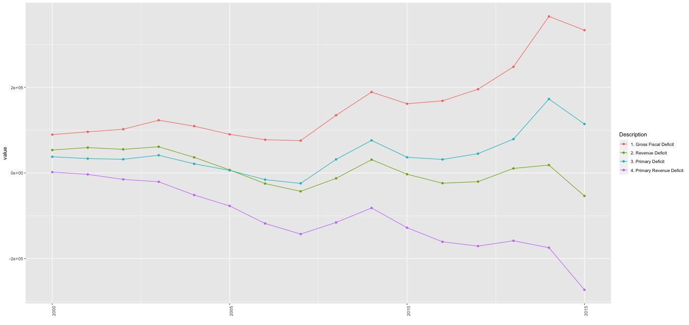

Some important fiscal indicators of Indian States
========================================================
author: Khaijamang Mate
date: October 6, 2020
autosize: true

Peer-graded Assignment: Shiny Application and Reproducible Pitch
========================================================

- This shiny app is submitted for Coursera online course on _Developing Data Products_ 
- This peer assessed assignment has two parts:
  1. Shiny application (Click here: https://kmatein.shinyapps.io/DevelopingDataProduct_Wk4Assignment/)
  2. Reproducible Pitch Presentation ( https://k-mate.github.io/DevelopingDataProduct_Wk4Assignment/index.html)
  

Shiny Application
========================================================

- Shiny project has two outputs - a chart and a table - on some important fiscal indicators of Indian States
- It has three input widgets 
- Data for this are compiled from _State Finances: A Study of Budgets_ (published annually by the Reserve Bank of India) which are publicly available
- Data and R codes for this presentation are hosted on github: https://github.com/k-mate/DevelopingDataProduct_Wk4Assignment

An example of R-chart generated from the data
========================================================

Thank You
========================================================

